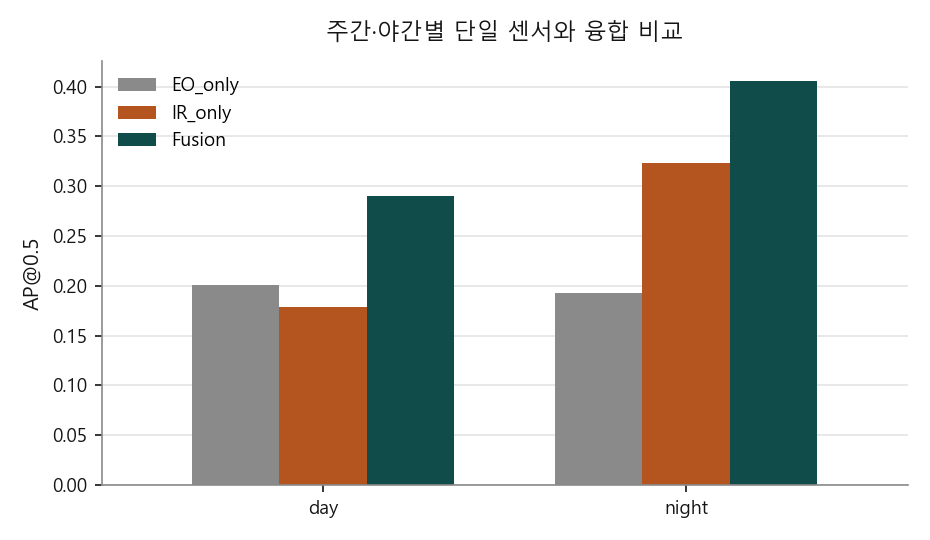
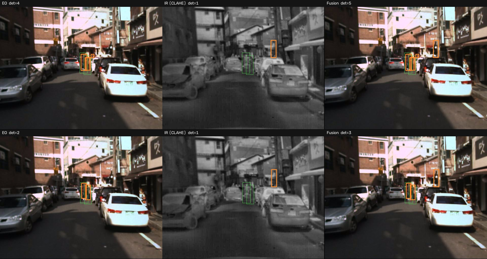
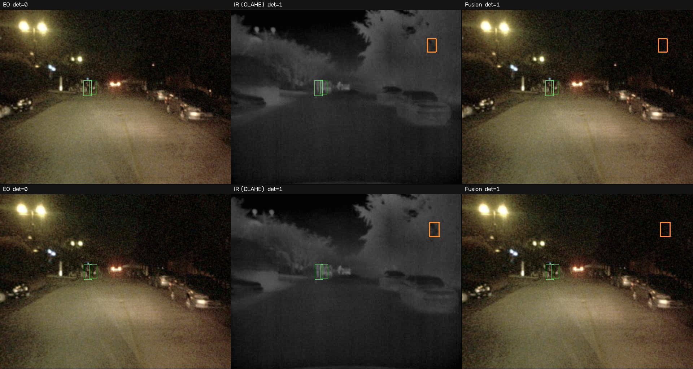
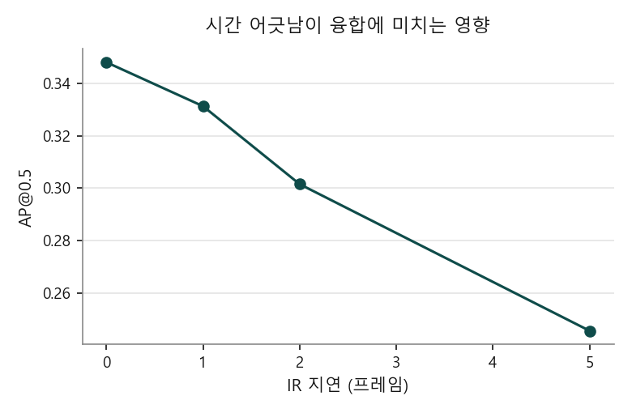

# EO/IR Sensor Fusion for Robust Multi-Object Tracking

가시광(EO)과 열화상(IR)의 탐지 결과를 결합해 사람을 추적하고,
**한쪽 센서가 끊기거나 늦어질 때 시스템이 어떻게 무너지는지**를 정량 측정한다.

정확도 경쟁이 목적이 아니다. 답하려는 질문은 넷이다.

1. **IR은 언제 EO를 이기는가**
2. **융합은 언제 가장 값진가**
3. **한쪽 센서를 잃으면 무엇이 먼저 무너지는가**
4. **결손과 시간 어긋남은 어떻게 다른가**

2번과 4번의 답이 예상 밖이었다.

---

## 실험 설정

KAIST Multispectral Pedestrian, **주간 3 · 야간 3 시퀀스**(정답 밀도 상위에서 균형 선택), 시퀀스당 1,200프레임.
YOLO11n COCO 사전학습, 입력 1280, RTX 4060.

```
set02/V001[주] set01/V001[주] set08/V002[주]
set03/V001[야] set11/V000[야] set03/V000[야]
```

---

## ① IR은 언제 EO를 이기는가 — 밤이라서가 아니다

| | EO 단독 | IR 단독 | 융합 |
|---|---:|---:|---:|
| **주간** | **0.201** | 0.179 | **0.290** |
| **야간** | 0.193 | **0.324** | **0.406** |

주간엔 EO가, 야간엔 IR이 앞선다. 여기까지는 예상대로다.



**그런데 시퀀스별로 보면 이 구분이 깨진다.**

| 시퀀스 | 시간대 | EO | IR |
|---|---|---:|---:|
| set03/V000 | 야간 | 0.052 | **0.447** |
| set03/V001 | 야간 | 0.030 | **0.233** |
| **set11/V000** | **야간** | **0.498** | 0.291 |
| set02/V001 | 주간 | **0.324** | 0.251 |
| set08/V002 | 주간 | **0.133** | 0.027 |

**set11은 야간인데 EO가 IR을 1.7배 앞선다.** 조명이 밝은 시내 야간이다.
반대로 set08은 주간인데 IR이 거의 실패한다(0.027). 낮에는 사람과 배경의 온도 차가 작다.

**`밤이면 IR`이 아니라 `조명과 열 대비에 달렸다`** 가 정확한 결론이다.
센서를 고정 배분하지 말고 장면 조건으로 판단해야 한다는 뜻이기도 하다.

### 정성 비교

**주간** — EO가 4개를 찾을 때 IR은 1개를 찾는다.


**야간** — EO가 아무것도 찾지 못하는 프레임에서 IR은 찾아낸다.


왼쪽부터 EO, IR(CLAHE), 융합. 초록이 정답, 주황이 탐지다.

---

## ② 융합은 두 센서가 비등할 때 가장 값지다

| | 더 나은 단일 센서 | 융합 | 이득 |
|---|---:|---:|---:|
| **주간** | 0.201 (EO) | 0.290 | **+44%** |
| **야간** | 0.324 (IR) | 0.406 | **+25%** |

**융합의 이득은 야간이 아니라 주간에 더 크다.**

야간에는 IR이 EO를 1.7배 앞서므로 EO가 보탤 것이 적다.
주간에는 두 센서가 0.201 대 0.179로 비등해 서로의 빈 곳을 메운다.

한쪽이 압도하는 조건에서는 융합을 붙일 값어치가 줄어든다.

---

## ③ 비대칭 — 어느 쪽을 잃는 것이 더 아픈가

전체(주·야 합산) 기준이다.

| 열화 | AP@0.5 | 기준 대비 |
|---|---:|---:|
| 없음 | 0.348 | — |
| **IR** 70% 결손 | 0.241 | **−31%** |
| **EO** 70% 결손 | 0.277 | **−20%** |

IR 쪽이 더 아프지만 야간만 볼 때만큼 극단적이지는 않다.
야간 시퀀스만 따로 보면 EO는 70%를 잃어도 11%만 떨어진다.


---

## ④ 결손과 지연은 크기가 같아도 증상이 다르다 — 가장 값진 발견

먼저 크기를 맞춰 보면, **IR이 5프레임(0.25초) 어긋나는 것은 IR을 70% 잃는 것과 같다.**

| 열화 | AP@0.5 | 기준 대비 |
|---|---:|---:|
| IR 1프레임 지연 | 0.331 | −5% |
| IR 2프레임 지연 | 0.302 | −13% |
| IR 30% 결손 | 0.295 | −15% |
| IR 5프레임 지연 | 0.246 | **−29%** |
| IR 70% 결손 | 0.241 | **−31%** |

**그런데 추적을 보면 둘이 전혀 다르다.**

| | 평균 트랙 길이 | 트랙당 끊김 |
|---|---:|---:|
| 정상 | 21.0 | 1.36 |
| IR 70% **결손** | **13.6** | **1.62** |
| IR 5프레임 **지연** | **20.9** | 1.39 |

**결손은 트랙을 35% 토막 낸다.** 관측이 없는 프레임이 생겨 추적이 끊긴다.
**지연은 트랙 길이를 그대로 둔 채 위치만 틀리게 만든다.** 관측은 계속 들어오므로 추적은 이어지지만
박스가 과거 자리에 찍혀 정답과 겹치지 않는다.

성능 하락폭이 같아도 현장에서 봐야 할 지표가 다르다.
**트랙이 짧아지면 가용성을, 트랙은 멀쩡한데 정확도만 떨어지면 동기화를 의심해야 한다.**



---

## 실험 설계에서 한 번 틀렸던 것

처음에는 프레임을 하나씩 건너뛰며(stride 2) 600프레임만 돌렸다.
그 결과 **IR 1프레임 지연이 AP를 65% 떨어뜨리는 것으로 나왔다.**

전체 프레임(stride 1)으로 다시 돌리니 같은 조건이 **−5%**였다.
stride 2에서의 `1프레임 지연`은 원본 기준으로 **2프레임 어긋남**이었기 때문이다.

시간 해상도를 통제하지 않으면 시간에 관한 결론이 그대로 뒤집힌다.
이 저장소의 모든 지연 실험은 stride 1에서만 수행한다.

같은 종류의 함정이 둘 더 있었다.
- **정답이 하나도 없는 시퀀스** — 앞에서부터 뽑으면 set00/V000이 걸리는데 앞 300프레임에 사람이 없다.
  정답 밀도를 재서 고르도록 `--dense`를 넣었다
- **주간만 뽑히는 선택** — 시퀀스가 set 순서로 정렬되어 앞에서 자르면 주간만 들어간다.
  주·야를 번갈아 뽑는 `--balanced`를 넣었다

---

## 부수적으로 얻은 것 — 전처리 효과가 입력 크기에 따라 뒤집힌다

IR을 COCO 사전학습 모델에 넣기 전 전처리를 비교했다.
정답이 2명 이상인 프레임 6개(정답 12명)에서 탐지 개수를 셌다.

| 입력 크기 | 신뢰도 | IR 전처리 | EO 탐지 | IR 탐지 |
|---:|---:|---|---:|---:|
| 640 | 0.15 | 무엇이든 | 0 | 0 |
| 640 | 0.01 | 그레이스케일 | 4 | **44** |
| 640 | 0.01 | + CLAHE | 4 | 5 |
| 1280 | 0.05 | + CLAHE | 0 | **6** |
| 1280 | 0.01 | 그레이스케일 | 31 | 17 |
| 1280 | 0.01 | + CLAHE | 31 | **78** |

**640에서는 CLAHE가 해롭고(44 → 5), 1280에서는 크게 이롭다(17 → 78).**
대비를 올리면 잡음도 함께 올라오는데, 작은 입력에서는 그 잡음이 표적을 덮어버린다.
전처리는 고정값이 아니라 입력 크기와 함께 정해야 한다.

---

## 구조

```
EO 프레임 ──> 탐지기 ──┐
                       ├──> late fusion ──> 추적기 ──> 트랙
IR 프레임 ──> 탐지기 ──┘         ^
                                 │
                         센서 열화 주입기
                   (결손 / 지연 / 잡음 / 흐림)
```

- **탐지** — YOLO11n COCO 사전학습
- **IR 전처리** — 팔레트를 걷어내 휘도만 남기고 CLAHE로 대비를 올린다
- **융합** — IoU로 짝지은 뒤 신뢰도 가중 평균으로 박스를 합치고,
  두 센서가 모두 본 표적은 신뢰도를 올린다(noisy-or). 짝이 없는 박스는 감점해 살린다
- **추적** — ByteTrack의 2단계 연관을 재구현했다.
  외부 추적기를 쓰지 않은 이유는 **센서가 끊겼을 때 트랙을 유지하는 정책**을 직접 제어해야 하기 때문이다

### 설계에서 신경 쓴 것

**탐지 결과를 캐시한다.** 조건이 14가지인데 조건마다 탐지를 다시 돌리면 시간이 14배가 된다.
EO/IR 탐지를 한 번만 계산해 저장하고, 결손·지연처럼 **결과 수준의 열화는 캐시 위에서** 적용한다.
조건 하나를 추가하는 데 분 단위가 아니라 0.2초가 든다.
잡음·흐림은 이미지 자체를 바꾸므로 예외이고, 캐시 파일명으로 조건을 구분해 재탐지한다.

**추적 기준은 탐지 임계값을 따라간다.** 탐지 신뢰도를 0.01까지 내려놓고 추적기의 고신뢰 기준을
0.5로 두면 새 트랙이 하나도 생기지 않는다. 1차 실행에서 트랙이 0개로 나와 발견한 문제다.

---

## 속도

프레임당 EO+IR 탐지 합계, 입력 1280.

| 실행 | p50 | p95 |
|---|---:|---:|
| CPU (Ryzen 5 5600) | 268ms | 332ms |
| **GPU (RTX 4060)** | **40ms** | **51ms** |

---

## 데이터

**KAIST Multispectral Pedestrian Benchmark** — 41개 시퀀스, 95,324쌍
- 빔 스플리터로 촬영해 **가시광과 열화상이 하드웨어 수준에서 정합**되어 있다.
  late fusion의 IoU 매칭은 이 정합을 전제로 한다
- 640×512, 20Hz 연속 영상, set00~11(주간 6 · 야간 6)
- 주석은 정제본(`annotations-xml-new-sanitized`)을 쓴다
- 라이선스 CC BY-NC-SA 4.0 — **데이터는 재배포하지 않는다.** 내려받는 스크립트만 둔다

> 배포 파일은 확장자가 실제 형식과 다르다. 프리뷰(.zip 안내)는 gzip tar, 전체는 비압축 tar다.
> 스크립트가 매직 바이트로 판별한다.

### 검토했으나 쓰지 않은 데이터

| 데이터 | 배제 사유 |
|---|---|
| VT-MOT | 바이두 클라우드 단일 배포로 접근 곤란 |
| RGBT-Tiny | 신청서 승인 필요 |
| M3OT | **두 대의 드론에서 서로 다른 시점으로 촬영** — 화소 단위 정합이 아니라 IoU 매칭이 성립하지 않는다 |

---

## 실행

```bash
pip install -r requirements.txt

# 데이터 (프리뷰 1.5GB / 전체 37GB)
python scripts/download_kaist.py
python scripts/download_kaist.py --full

# 조건별 실험 — 지연 실험은 stride 1에서만 유효하다
python scripts/run_experiments.py \
  --data data/kaist_full --dense --balanced --max-seq 6 \
  --limit 1200 --stride 1 \
  --weights yolo11n.pt --imgsz 1280 --conf 0.01 \
  --ir-preprocess clahe --op-conf 0.10 --device 0 --out results/full

# 표와 그래프
python scripts/make_report.py --results results/full/results.csv --out results/full

# 정성 비교 그림
python scripts/make_demo.py --data data/kaist_full --seq set02/V001 \
  --weights yolo11n.pt --out results/full --name demo_day.jpg

# KAIST 미세조정
python scripts/prepare_yolo.py --data data/kaist_full --modality lwir --stride 4
python scripts/train_finetune.py --data data/yolo/lwir/data.yaml --name lwir --device 0
```

---

## 한계

정직하게 적는다.

- **절대 성능이 낮다.** COCO 사전학습 가중치를 그대로 썼다. 보행자가 작고(대부분 30×70픽셀 이하)
  야간은 학습 분포에서 크게 벗어난다. AP 0.35는 그 한계를 그대로 보여준다.
  이 저장소의 결론은 **조건 간 비교**이지 절대 성능이 아니다
- **6개 시퀀스, 시퀀스당 1,200프레임**만 썼다. 전체 95,324쌍 중 일부다
- **표준 MOT 지표를 쓰지 못했다.** 이 데이터에는 정답 추적 ID가 없다.
  MOTA·HOTA는 산출하지 않고 같은 시퀀스에서 조건만 바꿔 상대 비교했다.
  **없는 지표를 지어내지 않기 위한 선택이다**
- **정밀도가 낮다.** 표적이 작아 오탐이 많다. IR에서 하늘과 건물의 경계를 사람으로 오인하는 사례가 보인다

## 다음에 할 일

- **미세조정 결과 반영** — 절대 성능이 올라갈 때 조건 간 차이가 더 또렷해지는지
- **장면 조건 판별** — set11처럼 야간에도 EO가 우세한 경우를 자동으로 가려내 가중치를 조정
- 잡음·흐림 같은 **이미지 수준 열화**의 저하 곡선

## 라이선스

MIT (코드). 데이터는 원 배포처의 라이선스를 따른다.
