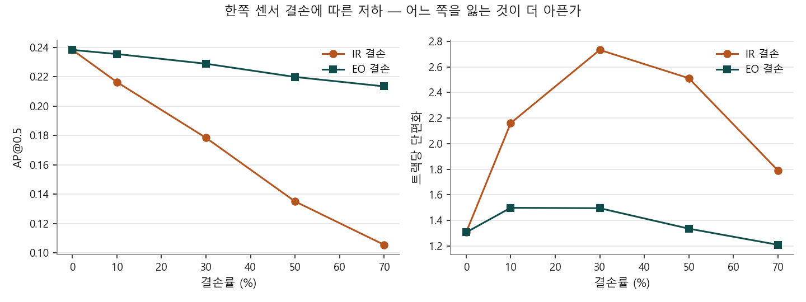
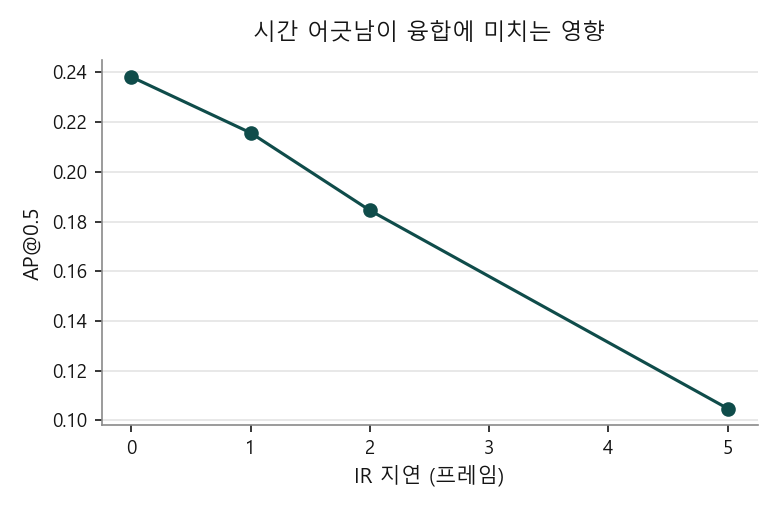

# EO/IR Sensor Fusion for Robust Multi-Object Tracking

가시광(EO)과 열화상(IR)의 탐지 결과를 결합해 사람을 추적하고,
**한쪽 센서가 끊기거나 늦어질 때 시스템이 어떻게 무너지는지**를 정량 측정한다.

정확도 경쟁이 목적이 아니다. 이 저장소가 답하려는 질문은 셋이다.

1. **야간에 IR은 EO보다 얼마나 나은가**
2. **한쪽 센서를 잃으면 무엇이 먼저 무너지는가** — EO 결손과 IR 결손을 나눠 본다
3. **결손과 시간 어긋남은 어떻게 다른가**

세 번째 질문의 답이 가장 값졌다. 둘은 성능을 같은 폭으로 떨어뜨리지만 **증상이 정반대다.**

---

## 결과

야간 시퀀스(KAIST set04/V001) 3,200프레임 전체, YOLO11n COCO 사전학습, 입력 1280.

| 조건 | AP@0.5 | 재현율 | 운용 F1 | 트랙 수 | 평균 트랙 길이 | 트랙당 끊김 |
|---|---:|---:|---:|---:|---:|---:|
| EO 단독 | 0.061 | 0.336 | 0.111 | 314 | 12.2 | 1.59 |
| IR 단독 | 0.200 | 0.631 | 0.282 | 513 | **26.5** | **1.23** |
| **융합** | **0.238** | **0.682** | **0.299** | **687** | 22.7 | 1.31 |

> 운용 F1은 신뢰도 0.10 기준이다. AP는 PR 곡선을 그리려고 0.01까지 내려가 계산하므로
> 그 설정의 정밀도는 운용값이 아니다. 두 가지를 분리해 보고한다.

### ① 야간에 IR이 EO를 압도한다

AP 기준 3.3배(0.200 대 0.061)다. 가시광은 **신뢰도 0.15에서 탐지가 아예 0개**였다.
트랙도 IR이 더 길고(26.5 대 12.2) 덜 끊긴다(1.23 대 1.59).


왼쪽부터 EO, IR(CLAHE), 융합. 초록이 정답, 주황이 탐지다.
**EO가 아무것도 찾지 못하는 프레임에서 IR은 찾아낸다.**

### ② 융합은 공짜가 아니다

재현율·트랙 수는 융합이 가장 높지만 **평균 트랙 길이는 IR 단독이 더 길다**(26.5 → 22.7).
융합이 EO의 오탐까지 받아들여 짧은 가짜 트랙을 만들기 때문이다.
운용 F1은 여전히 융합이 앞선다(0.299 대 0.282).

### ③ 비대칭이 뚜렷하다

| 열화 | AP@0.5 | 기준 대비 |
|---|---:|---:|
| 없음 | 0.238 | — |
| **IR** 70% 결손 | 0.106 | **−56%** |
| **EO** 70% 결손 | 0.213 | **−11%** |

야간에 EO는 사실상 기여하지 않는다. 70%를 잃어도 11%만 떨어진다.



### ④ 결손과 지연은 크기가 같아도 증상이 다르다

먼저 크기를 맞춰 보면, **IR이 5프레임(0.25초) 어긋나는 것은 IR을 70% 잃는 것과 같다.**

| 열화 | AP@0.5 | 기준 대비 |
|---|---:|---:|
| IR 1프레임 지연 | 0.216 | −9% |
| IR 2프레임 지연 | 0.184 | −23% |
| IR 30% 결손 | 0.178 | −25% |
| IR 5프레임 지연 | 0.105 | −56% |
| IR 70% 결손 | 0.106 | −56% |

**그런데 추적을 보면 둘이 전혀 다르다.**

| | 평균 트랙 길이 | 트랙당 끊김 |
|---|---:|---:|
| 정상 | 22.7 | 1.31 |
| IR 70% 결손 | **9.4** | **1.79** |
| IR 5프레임 지연 | 22.3 | 1.35 |

**결손은 트랙을 토막 낸다.** 관측이 없는 프레임이 생겨 추적이 끊긴다.
**지연은 트랙을 유지한 채 위치만 틀리게 만든다.** 관측은 계속 들어오므로 추적은 이어지지만
박스가 과거 자리에 찍혀 정답과 겹치지 않는다.

성능 하락폭이 같아도 현장에서 봐야 할 지표가 다르다는 뜻이다.
트랙이 짧아지면 가용성을, 트랙은 멀쩡한데 정확도만 떨어지면 동기화를 의심해야 한다.



---

## 실험 설계에서 한 번 틀렸던 것

처음에는 프레임을 하나씩 건너뛰며(stride 2) 600프레임만 돌렸다.
그 결과 **IR 1프레임 지연이 AP를 65% 떨어뜨리는 것으로 나왔다.**

전체 프레임(stride 1)으로 다시 돌리니 같은 조건이 **−9%**였다.
stride 2에서의 `1프레임 지연`은 원본 기준으로 **2프레임 어긋남**이었기 때문이다.

시간 해상도를 통제하지 않으면 시간에 관한 결론이 그대로 뒤집힌다.
이 저장소의 모든 지연 실험은 stride 1에서만 수행한다.

---

## 부수적으로 얻은 것 — 전처리 효과가 입력 크기에 따라 뒤집힌다

IR을 COCO 사전학습 모델에 넣기 전 전처리를 비교했다.
정답이 2명 이상인 프레임 6개(정답 12명)에서 탐지 개수를 셌다.

| 입력 크기 | 신뢰도 | IR 전처리 | EO 탐지 | IR 탐지 |
|---:|---:|---|---:|---:|
| 640 | 0.15 | 무엇이든 | 0 | 0 |
| 640 | 0.01 | 그레이스케일 | 4 | **44** |
| 640 | 0.01 | + CLAHE | 4 | 5 |
| 1280 | 0.05 | + CLAHE | 0 | **6** |
| 1280 | 0.01 | 그레이스케일 | 31 | 17 |
| 1280 | 0.01 | + CLAHE | 31 | **78** |

**640에서는 CLAHE가 해롭고(44 → 5), 1280에서는 크게 이롭다(17 → 78).**
대비를 올리면 잡음도 함께 올라오는데, 작은 입력에서는 그 잡음이 표적을 덮어버린다.
전처리는 고정값이 아니라 입력 크기와 함께 정해야 한다.

---

## 구조

```
EO 프레임 ──> 탐지기 ──┐
                       ├──> late fusion ──> 추적기 ──> 트랙
IR 프레임 ──> 탐지기 ──┘         ^
                                 │
                         센서 열화 주입기
                       (결손 / 지연 / 잡음 / 흐림)
```

- **탐지** — YOLO11n. COCO 사전학습을 그대로 쓴다(융합과 강건성이 관심사이므로)
- **IR 전처리** — 팔레트를 걷어내 휘도만 남기고 CLAHE로 대비를 올린다
- **융합** — IoU로 짝지은 뒤 신뢰도 가중 평균으로 박스를 합치고,
  두 센서가 모두 본 표적은 신뢰도를 올린다(noisy-or). 짝이 없는 박스는 감점해 살린다
- **추적** — ByteTrack의 2단계 연관을 재구현했다.
  외부 추적기를 쓰지 않은 이유는 **센서가 끊겼을 때 트랙을 유지하는 정책**을 직접 제어해야 하기 때문이다

### 설계에서 신경 쓴 것

**탐지 결과를 캐시한다.** 조건이 14가지인데 조건마다 탐지를 다시 돌리면 시간이 14배가 된다.
EO/IR 탐지를 한 번만 계산해 저장하고, 결손·지연처럼 **결과 수준의 열화는 캐시 위에서** 적용한다.
조건 하나를 추가하는 데 3분이 아니라 0.2초가 든다.

**추적 기준은 탐지 임계값을 따라간다.** 탐지 신뢰도를 0.01까지 내려놓고 추적기의 고신뢰 기준을
0.5로 두면 새 트랙이 하나도 생기지 않는다. 1차 실행에서 트랙이 0개로 나와 발견한 문제다.

---

## 속도

프레임당 EO+IR 탐지 합계, 입력 1280.

| 실행 | p50 | p95 |
|---|---:|---:|
| CPU (Ryzen 5 5600) | 268ms | 332ms |
| **GPU (RTX 4060)** | **36.6ms** | **39.9ms** |

---

## 데이터

**KAIST Multispectral Pedestrian Benchmark**
- 빔 스플리터로 촬영해 **가시광과 열화상이 하드웨어 수준에서 정합**되어 있다.
  late fusion의 IoU 매칭은 이 정합을 전제로 한다
- 640×512, 20Hz 연속 영상
- 라이선스 CC BY-NC-SA 4.0 — **데이터는 재배포하지 않는다.** 내려받는 스크립트만 둔다

### 검토했으나 쓰지 않은 데이터

| 데이터 | 배제 사유 |
|---|---|
| VT-MOT | 바이두 클라우드 단일 배포로 접근 곤란 |
| RGBT-Tiny | 신청서 승인 필요 |
| M3OT | **두 대의 드론에서 서로 다른 시점으로 촬영** — 화소 단위 정합이 아니라 IoU 매칭이 성립하지 않는다 |

---

## 실행

```bash
pip install -r requirements.txt

# 데이터 (프리뷰 1.5GB / 전체 39GB)
python scripts/download_kaist.py
python scripts/download_kaist.py --full

# 조건별 실험 — 지연 실험은 stride 1에서만 유효하다
python scripts/run_experiments.py \
  --data data/kaist_preview --limit 0 --stride 1 \
  --weights yolo11n.pt --imgsz 1280 --conf 0.01 \
  --ir-preprocess clahe --op-conf 0.10 --device 0 --out results/night_full

# 표와 그래프
python scripts/make_report.py --results results/night_full/results.csv --out results/night_full

# 정성 비교 그림
python scripts/make_demo.py --weights yolo11n.pt --out results/night_full

# (선택) KAIST 미세조정
python scripts/prepare_yolo.py --data data/kaist_full --modality lwir
python scripts/train_finetune.py --data data/yolo/lwir/data.yaml --name lwir --device 0
```

---

## 한계

정직하게 적는다.

- **절대 성능이 낮다.** COCO 사전학습 가중치를 그대로 썼다. 야간 보행자는 학습 분포에서
  크게 벗어나며 AP 0.24는 그 한계를 그대로 보여준다.
  이 저장소의 결론은 **조건 간 비교**이지 절대 성능이 아니다
- **야간 시퀀스 하나만 썼다.** 공개 프리뷰에 set04/V001만 들어 있다.
  주간 비교는 전체 배포본(39GB)이 필요하며 스크립트는 준비돼 있다
- **표준 MOT 지표를 쓰지 못했다.** 이 데이터에는 정답 추적 ID가 없다.
  MOTA·HOTA는 산출하지 않고 같은 시퀀스에서 조건만 바꿔 상대 비교했다.
  **없는 지표를 지어내지 않기 위한 선택이다**
- **정밀도가 낮다.** 표적이 작고 야간이라 오탐이 많다. IR에서 하늘과 나무의 경계를
  사람으로 오인하는 사례가 보인다

## 다음에 할 일

- 전체 배포본으로 **주간·야간 비교** — 주간에는 EO가 우세할 것이고 융합의 값어치가 달라진다
- KAIST로 **미세조정** — 절대 성능을 올려 조건 간 차이가 더 또렷해지는지 확인
- 잡음·흐림 같은 **이미지 수준 열화** 추가(현재는 결손·지연만 캐시 위에서 처리)

## 라이선스

MIT (코드). 데이터는 원 배포처의 라이선스를 따른다.
