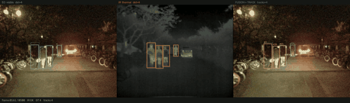

# EO/IR Sensor Fusion for Multi-Object Tracking

Late fusion of visible (EO) and thermal (IR) detections for pedestrian tracking,
with controlled sensor degradation to measure where the system breaks.

**Dataset** KAIST Multispectral Pedestrian — 41 sequences, 95,324 aligned pairs (640×512, 20 Hz).
Experiments use 6 sequences (3 day / 3 night, selected by annotation density), 1,200 frames each.
**Model** YOLO11n, COCO pre-trained and KAIST fine-tuned. **Hardware** RTX 4060.

---

## Main result: fusion gain scales inversely with single-sensor quality

Same pipeline, two detector sets. AP@0.5, 640 input.

| | EO | IR | Fusion | Gain over best single |
|---|---:|---:|---:|---:|
| COCO · day | 0.247 | 0.269 | 0.340 | **+26%** |
| COCO · night | 0.339 | 0.471 | 0.542 | **+15%** |
| Fine-tuned · day | 0.723 | 0.748 | 0.789 | **+5%** |
| Fine-tuned · night | 0.684 | **0.861** | 0.854 | **−1%** |


At operating threshold 0.10, fusion is worse than IR alone once detectors are competent:

| Fine-tuned | Precision | Recall | F1 |
|---|---:|---:|---:|
| EO only | 0.451 | 0.801 | 0.557 |
| IR only | 0.568 | 0.874 | **0.683** |
| Fusion | 0.361 | **0.919** | 0.512 |

### Why

Change from IR-only to fusion:

| | Precision | Recall |
|---|---:|---:|
| COCO | −0.060 | **+0.105** |
| Fine-tuned | **−0.207** | +0.045 |


Weak detectors miss different targets, so fusion recovers them (recall +0.105).
Strong detectors already find most targets, leaving little to recover (+0.045) while their
false positives add up (precision −0.207).

Track counts confirm it: IR alone produces 164 tracks, fusion 350, on the same targets.
The extra tracks are spurious.

**Implication** — improve single sensors before adding fusion. Fine-tuning gave 2–3× AP
(0.34 → 0.79); fusion gave +26%. Always check post-fusion precision, not only recall.

---

## Dropout and delay degrade by the same amount but leave different traces

Fine-tuned models, averaged over all sequences.

| | AP@0.5 | vs baseline | Mean track length |
|---|---:|---:|---:|
| Baseline | 0.822 | — | 39.8 |
| IR 70% **dropout** | 0.722 | −12% | **35.7** |
| IR 5-frame **delay** | 0.636 | **−23%** | **39.6** |

Dropout removes observations, so tracks fragment and shorten.
Delay keeps observations coming, so track length is unchanged, but boxes land at stale
positions and stop overlapping ground truth.

Short tracks point to sensor availability. Intact tracks with falling accuracy point to
synchronisation.


### Visual check

IR signal cut between frames 180 and 300 of a night sequence.
Left: EO. Centre: IR. Right: fusion with track IDs and trails.



Track IDs persist while the thermal channel is down. Missing observations are propagated by
constant-velocity prediction and re-associated to the same ID on recovery.

Full videos (25 s, day and night) are written to `results/video/` and not committed.

---

## Fine-tuning

| Model | mAP50 | Epochs | Time |
|---|---:|---:|---:|
| IR (lwir) | 0.574 | 15 | 35.4 min |
| EO (visible) | 0.577 | 15 | 39.6 min |

Training set 5,426 images, validation 5,410 (KAIST split: set00–05 / set06–11), 640 input, batch 16.

Fine-tuned models take raw IR. CLAHE is only applied to COCO models, which were trained on
a different intensity distribution.

---

## Corrections

Three conclusions were overturned by re-measuring under stricter conditions. All are kept in
the repository history.

| Initial | Corrected | Cause |
|---|---|---|
| 1-frame IR delay costs 65% AP | **5%** | Measured with stride 2, so one frame was two frames of original video |
| One night sequence favours EO → depends on illumination | Reversed after fine-tuning | The detector could not read that scene's thermal image; not a sensor property |
| Fusion always helps | Only with weak detectors | See main result |

Delay experiments are valid only at stride 1.

---

## Method

```
EO frame ──> detector (EO weights) ──┐
                                     ├──> late fusion ──> tracker ──> tracks
IR frame ──> detector (IR weights) ──┘          ^
                                                │
                                      degradation injector
                                  (dropout / delay / noise / blur)
```

**Fusion** IoU matching, confidence-weighted box averaging, noisy-or confidence for targets
seen by both sensors. Unmatched boxes are kept with a confidence penalty.

**Tracker** Re-implementation of ByteTrack's two-stage association. Written rather than
imported so the track-retention policy under sensor loss is controllable.

**Detection cache** 14 conditions share one detection pass per sequence. Dropout and delay are
applied to cached results; noise and blur change the image and require re-detection, keyed by
cache filename.

**Tracker thresholds follow detection confidence.** With detection confidence at 0.01 and the
tracker's high threshold left at 0.5, no track is ever created.

**Sequence selection** `--dense` skips sequences with no annotated pedestrians;
`--balanced` alternates day and night, since sequences sort by set and truncation yields day only.

---

## Speed

Per frame, EO + IR detection combined.

| | Input | p50 |
|---|---:|---:|
| CPU (Ryzen 5 5600) | 1280 | 268 ms |
| GPU (RTX 4060) | 1280 | 40 ms |
| GPU (RTX 4060) | 640 | 12 ms |

---

## Data notes

KAIST images are captured through a beam splitter, so EO and IR are hardware-aligned.
IoU-based late fusion depends on this. Annotations use the sanitised set.
Licence CC BY-NC-SA 4.0 — data is not redistributed here, only the download script.

Archive formats do not match their extensions: the preview is gzip tar, the full set is plain
tar. The script identifies them by magic bytes.

Datasets considered and rejected:

| Dataset | Reason |
|---|---|
| VT-MOT | Distributed only via Baidu Pan |
| RGBT-Tiny | Access requires an approval form |
| M3OT | Captured by two drones from different viewpoints — not pixel-aligned, so IoU matching does not hold |

---

## Reproduce

```bash
pip install -r requirements.txt

python scripts/download_kaist.py --full

python scripts/prepare_yolo.py --data data/kaist_full --modality lwir --stride 4
python scripts/train_finetune.py --data data/yolo/lwir/data.yaml --name lwir --device 0 --workers 0

python scripts/run_experiments.py \
  --data data/kaist_full --dense --balanced --max-seq 6 --limit 1200 --stride 1 \
  --weights-eo runs/finetune/visible/weights/best.pt \
  --weights-ir runs/finetune/lwir/weights/best.pt \
  --imgsz 640 --conf 0.01 --ir-preprocess none --op-conf 0.10 \
  --device 0 --out results/finetuned

python scripts/make_report.py --results results/finetuned/results.csv --out results/finetuned
python scripts/make_compare.py

python scripts/make_video.py --data data/kaist_full --seq set03/V000 \
  --weights-eo runs/finetune/visible/weights/best.pt \
  --weights-ir runs/finetune/lwir/weights/best.pt \
  --conf 0.25 --start 60 --frames 500 --cut 180:300 \
  --device 0 --out results/video/night_tracking.mp4
```

On Windows, `--workers 0` is required; higher values fail in the pinned-memory thread with
`CUDA error: resource already mapped`.

---

## Limitations

- 6 sequences × 1,200 frames, a subset of the 95,324 available pairs.
- No ground-truth track IDs in this dataset, so MOTA and HOTA are not reported.
  Tracking is compared across conditions on the same sequences instead.
- One fusion strategy (IoU-based late fusion). Feature-level fusion and confidence
  reweighting are untested.
- Fine-tuning plateaus early: mAP50 0.535 at 2 epochs, 0.574 at 15.

## Licence

MIT for code. Data follows the original distributor's licence.
