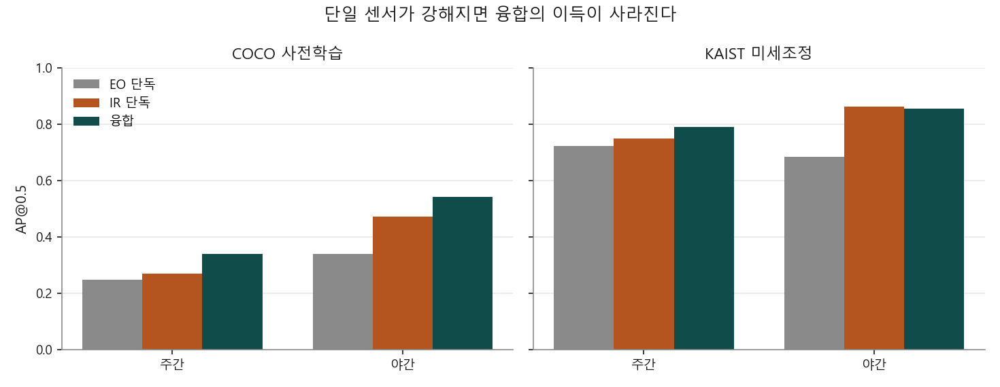
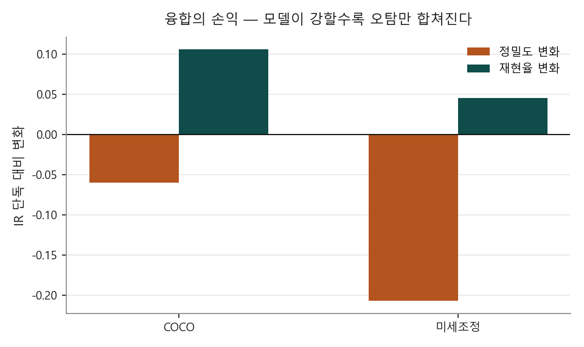
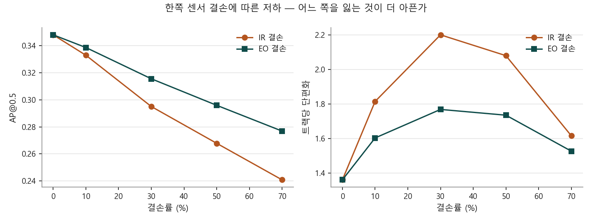

# EO/IR Sensor Fusion for Robust Multi-Object Tracking

가시광(EO)과 열화상(IR)의 탐지 결과를 결합해 사람을 추적하고,
**융합이 언제 값지고 언제 해가 되는지**, **한쪽 센서가 끊기거나 늦어질 때 무엇이 먼저 무너지는지**를 측정한다.

KAIST Multispectral Pedestrian, 주간 3 · 야간 3 시퀀스, 시퀀스당 1,200프레임, YOLO11n, RTX 4060.

---

## 핵심 결론 — 융합의 값어치는 단일 센서 성능에 반비례한다

같은 파이프라인을 **COCO 사전학습**과 **KAIST 미세조정** 두 모델로 돌렸다.

| | EO 단독 | IR 단독 | 융합 | 융합 이득 |
|---|---:|---:|---:|---:|
| **COCO · 주간** | 0.247 | 0.269 | **0.340** | **+26%** |
| **COCO · 야간** | 0.339 | 0.471 | **0.542** | **+15%** |
| **미세조정 · 주간** | 0.723 | 0.748 | 0.789 | **+5%** |
| **미세조정 · 야간** | 0.684 | **0.861** | 0.854 | **−1%** |

*(AP@0.5, 둘 다 640 입력)*



**약한 모델에서는 융합이 크게 이득이지만, 센서가 제 역할을 하면 이득이 사라지고 야간에는 오히려 손해다.**

운용 임계값(0.10)에서 보면 더 분명하다.

| 미세조정 | 정밀도 | 재현율 | F1 |
|---|---:|---:|---:|
| EO 단독 | 0.451 | 0.801 | 0.557 |
| **IR 단독** | **0.568** | 0.874 | **0.683** |
| 융합 | 0.361 | **0.919** | 0.512 |

**융합의 F1이 IR 단독보다 25% 낮다.**

### 왜 그런가 — 손익을 쪼개 보면

IR 단독 대비 융합의 변화다.

| | 정밀도 | 재현율 |
|---|---:|---:|
| COCO (약한 모델) | −0.060 | **+0.105** |
| 미세조정 (강한 모델) | **−0.207** | +0.045 |



**모델이 약하면** 각 센서가 놓치는 표적이 많아 서로 메울 여지가 크다(재현율 +0.105).
**모델이 강하면** 각자 이미 대부분 찾으므로 메울 여지가 없고(+0.045), **각자의 오탐만 합쳐진다**(정밀도 −0.207).

트랙 수가 증거다. 미세조정에서 **IR 단독 164개 → 융합 350개.**
실제 표적은 그대로인데 트랙이 2배가 됐다. 늘어난 것은 가짜 트랙이다.

### 실무적 함의

**융합을 붙이기 전에 단일 센서를 먼저 개선해야 한다.**
미세조정 한 번이 AP를 2~3배 올렸다(0.34 → 0.79). 융합이 준 것은 +26%였다.
순서를 거꾸로 잡으면 약한 모델 위에 융합을 얹어 놓고 "융합 덕분에 좋아졌다"고 착각하게 된다.

late fusion을 쓸 때는 **결합 후 정밀도가 떨어지지 않는지**를 반드시 같이 봐야 한다.
재현율만 보면 융합은 언제나 이긴다.

---

## 결손과 지연은 크기가 같아도 증상이 다르다

이 결론은 두 모델 모두에서 유지됐다.

| 미세조정 | AP@0.5 | 기준 대비 | 평균 트랙 길이 |
|---|---:|---:|---:|
| 정상 | 0.822 | — | 39.8 |
| IR 70% **결손** | 0.722 | −12% | **35.7** |
| IR 5프레임 **지연** | 0.636 | **−23%** | **39.6** |

**결손은 트랙을 짧게 만든다.** 관측이 없는 프레임이 생겨 추적이 끊긴다.
**지연은 트랙 길이를 그대로 둔 채 위치만 틀리게 만든다.** 관측은 계속 들어오므로 추적은 이어지지만
박스가 과거 자리에 찍혀 정답과 겹치지 않는다.

**트랙이 짧아지면 가용성을, 트랙은 멀쩡한데 정확도만 떨어지면 동기화를 의심해야 한다.**

COCO 모델에서는 이 차이가 더 극단적이었다(트랙 길이 21.0 → 13.6 대 20.9).
미세조정 후에는 EO가 강해져 IR 결손을 어느 정도 메우기 때문에 결손의 타격이 줄었다.



---

## 틀렸다가 바로잡은 것 셋

이 저장소에서 결론이 세 번 뒤집혔다. 모두 남겨 둔다.

### ① 지연의 영향을 13배 과장했다
처음에는 프레임을 하나씩 건너뛰며(stride 2) 600프레임만 돌렸고,
**IR 1프레임 지연이 AP를 65% 떨어뜨리는 것으로 나왔다.**
전체 프레임(stride 1)으로 다시 재니 **−5%**였다.
stride 2에서의 `1프레임`은 원본 기준 **2프레임 어긋남**이었다.
시간 해상도를 통제하지 않으면 시간에 관한 결론이 그대로 뒤집힌다.

### ② `야간인데 EO가 우세한 예외`는 모델의 약점이었다
COCO 모델에서 set11/V000은 야간인데 EO(0.498)가 IR(0.291)을 앞섰다.
`밤이라서가 아니라 조명에 달렸다`고 결론 냈는데, 미세조정하니 뒤집혔다(EO 0.468, IR 0.678).
**센서 특성이 아니라 모델이 그 장면의 IR을 못 읽었을 뿐이다.**

### ③ `융합이 항상 낫다`가 아니었다
위의 핵심 결론이다. 약한 모델에서만 성립한다.

세 번 모두 **더 정확한 조건에서 다시 재자 결론이 바뀌었다.**
한 번의 측정으로 결론을 내리지 않는 것이 이 저장소의 방식이다.

---

## 부수적으로 얻은 것

### 전처리 효과가 입력 크기에 따라 뒤집힌다
COCO 모델에 IR을 넣기 전 전처리를 비교했다. 정답 2명 이상인 프레임 6개(정답 12명)의 탐지 개수다.

| 입력 | 신뢰도 | IR 전처리 | EO | IR |
|---:|---:|---|---:|---:|
| 640 | 0.15 | 무엇이든 | 0 | 0 |
| 640 | 0.01 | 그레이스케일 | 4 | **44** |
| 640 | 0.01 | + CLAHE | 4 | 5 |
| 1280 | 0.01 | 그레이스케일 | 31 | 17 |
| 1280 | 0.01 | + CLAHE | 31 | **78** |

**640에서는 CLAHE가 해롭고(44 → 5), 1280에서는 크게 이롭다(17 → 78).**
대비를 올리면 잡음도 함께 올라오는데, 작은 입력에서는 그 잡음이 표적을 덮는다.

> 미세조정 모델에는 CLAHE를 쓰지 않는다. 원본 IR로 학습했으므로
> 추론에도 원본을 넣어야 학습과 입력이 일치한다.

### 입력을 키운다고 좋아지지 않았다
같은 COCO 모델로 set03/V000을 재면 640이 1280보다 나았다.

| 입력 | EO | IR | 융합 |
|---:|---:|---:|---:|
| 1280 | 0.052 | 0.447 | 0.458 |
| **640** | **0.256** | **0.608** | **0.634** |

1280에서는 작은 오탐이 훨씬 많이 생겨 정밀도가 무너진다.
`입력을 키우면 작은 표적에 유리하다`가 이 데이터에서는 성립하지 않았다.

---

## 구조

```
EO 프레임 ──> 탐지기(EO 가중치) ──┐
                                  ├──> late fusion ──> 추적기 ──> 트랙
IR 프레임 ──> 탐지기(IR 가중치) ──┘         ^
                                            │
                                    센서 열화 주입기
                              (결손 / 지연 / 잡음 / 흐림)
```

- **탐지** — YOLO11n. COCO 사전학습과 KAIST 미세조정 두 가지로 비교
- **융합** — IoU로 짝지은 뒤 신뢰도 가중 평균으로 박스를 합치고,
  두 센서가 모두 본 표적은 신뢰도를 올린다(noisy-or). 짝이 없는 박스는 감점해 살린다
- **추적** — ByteTrack의 2단계 연관을 재구현했다.
  외부 추적기를 쓰지 않은 이유는 **센서가 끊겼을 때 트랙을 유지하는 정책**을 직접 제어해야 하기 때문이다

### 설계에서 신경 쓴 것

**탐지 결과를 캐시한다.** 조건이 14가지인데 조건마다 탐지를 다시 돌리면 시간이 14배가 된다.
EO/IR 탐지를 한 번만 계산해 저장하고, 결손·지연처럼 **결과 수준의 열화는 캐시 위에서** 적용한다.
조건 하나를 추가하는 데 분 단위가 아니라 0.2초가 든다.
잡음·흐림은 이미지 자체를 바꾸므로 예외이고, 캐시 파일명으로 조건을 구분해 재탐지한다.

**추적 기준은 탐지 임계값을 따라간다.** 탐지 신뢰도를 0.01까지 내려놓고 추적기의 고신뢰 기준을
0.5로 두면 새 트랙이 하나도 생기지 않는다. 1차 실행에서 트랙이 0개로 나와 발견했다.

**시퀀스를 밀도와 시간대로 고른다.** 앞에서부터 뽑으면 정답이 하나도 없는 시퀀스(set00/V000)가 걸리고,
set 순서로 정렬되어 있어 주간만 들어간다. `--dense`와 `--balanced`로 막는다.

---

## 미세조정

| 모델 | mAP50 | 학습 시간 |
|---|---:|---:|
| IR (lwir) | 0.574 | 35.4분 |
| EO (visible) | 0.577 | 39.6분 |

15에폭, 640 입력, batch 16, 학습 5,426장 / 검증 5,410장.

> Windows에서 데이터 로더 워커를 늘리면 pinned memory 스레드가
> `CUDA error: resource already mapped`로 죽는다. `--workers 0`으로 피했고,
> 그 대가로 GPU 사용률이 16%에 머물렀다. 데이터 로딩이 병목이다.

---

## 속도

프레임당 EO+IR 탐지 합계.

| 실행 | 입력 | p50 |
|---|---:|---:|
| CPU (Ryzen 5 5600) | 1280 | 268ms |
| GPU (RTX 4060) | 1280 | 40ms |
| GPU (RTX 4060) | 640 | 12ms |

---

## 데이터

**KAIST Multispectral Pedestrian Benchmark** — 41개 시퀀스, 95,324쌍
- 빔 스플리터로 촬영해 **가시광과 열화상이 하드웨어 수준에서 정합**되어 있다.
  late fusion의 IoU 매칭은 이 정합을 전제로 한다
- 640×512, 20Hz 연속 영상, set00~11(주간 6 · 야간 6)
- 주석은 정제본(`annotations-xml-new-sanitized`)을 쓴다
- 라이선스 CC BY-NC-SA 4.0 — **데이터는 재배포하지 않는다.** 내려받는 스크립트만 둔다

> 배포 파일은 확장자가 실제 형식과 다르다. 프리뷰(.zip 안내)는 gzip tar, 전체는 비압축 tar다.
> 스크립트가 매직 바이트로 판별한다.

### 검토했으나 쓰지 않은 데이터

| 데이터 | 배제 사유 |
|---|---|
| VT-MOT | 바이두 클라우드 단일 배포로 접근 곤란 |
| RGBT-Tiny | 신청서 승인 필요 |
| M3OT | **두 대의 드론에서 서로 다른 시점으로 촬영** — 화소 단위 정합이 아니라 IoU 매칭이 성립하지 않는다 |

---

## 실행

```bash
pip install -r requirements.txt

# 데이터 (프리뷰 1.5GB / 전체 37GB)
python scripts/download_kaist.py --full

# 미세조정
python scripts/prepare_yolo.py --data data/kaist_full --modality lwir --stride 4
python scripts/train_finetune.py --data data/yolo/lwir/data.yaml --name lwir --device 0 --workers 0

# 조건별 실험 — 지연 실험은 stride 1에서만 유효하다
python scripts/run_experiments.py \
  --data data/kaist_full --dense --balanced --max-seq 6 --limit 1200 --stride 1 \
  --weights-eo runs/finetune/visible/weights/best.pt \
  --weights-ir runs/finetune/lwir/weights/best.pt \
  --imgsz 640 --conf 0.01 --ir-preprocess none --op-conf 0.10 \
  --device 0 --out results/finetuned

# 표와 그래프
python scripts/make_report.py --results results/finetuned/results.csv --out results/finetuned
python scripts/make_compare.py
```

---

## 한계

- **6개 시퀀스, 시퀀스당 1,200프레임**만 썼다. 전체 95,324쌍 중 일부다
- **표준 MOT 지표를 쓰지 못했다.** 이 데이터에는 정답 추적 ID가 없다.
  MOTA·HOTA는 산출하지 않고 같은 시퀀스에서 조건만 바꿔 상대 비교했다.
  **없는 지표를 지어내지 않기 위한 선택이다**
- **융합 방식이 하나다.** IoU 기반 late fusion만 다뤘다.
  신뢰도 가중을 조정하거나 특징 수준에서 융합하면 정밀도 손해를 줄일 수 있을 것이다
- **미세조정이 15에폭에서 멈췄다.** 2에폭에 mAP50 0.535, 15에폭에 0.574로
  대부분의 이득이 초반에 나왔다. 데이터를 늘리거나 모델을 키워야 더 오른다

## 다음에 할 일

- **정밀도를 지키는 융합** — 두 센서가 모두 본 표적만 남기는 보수적 결합과 비교
- 장면 조건에 따라 **센서 가중치를 조정**하는 방식
- 잡음·흐림 같은 **이미지 수준 열화**의 저하 곡선

## 라이선스

MIT (코드). 데이터는 원 배포처의 라이선스를 따른다.
