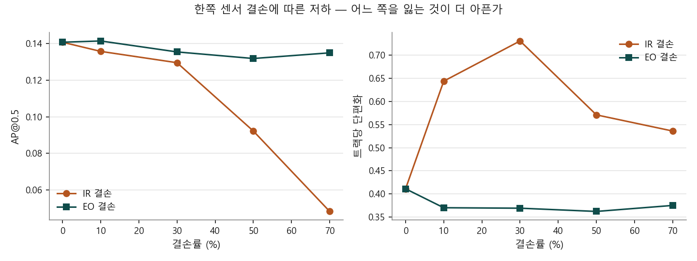
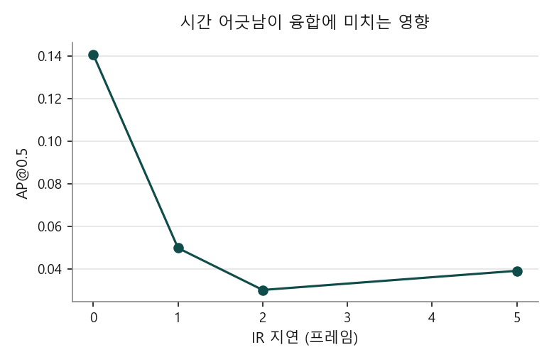
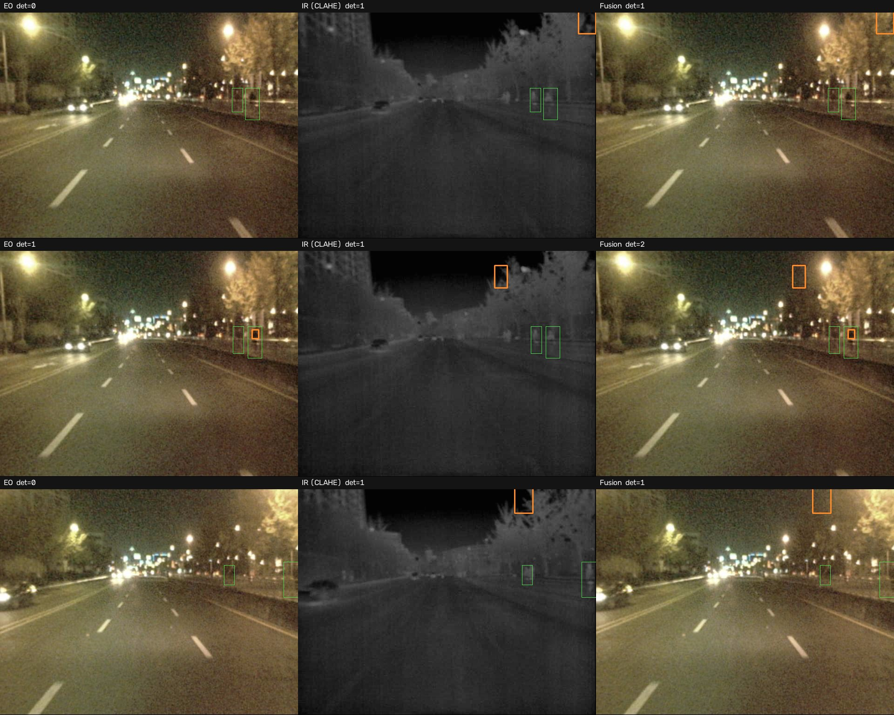

# EO/IR Sensor Fusion for Robust Multi-Object Tracking

가시광(EO)과 열화상(IR)의 탐지 결과를 결합해 사람을 추적하고,
**한쪽 센서가 끊기거나 늦어질 때 시스템이 얼마나 버티는지**를 정량 측정한다.

정확도 경쟁이 목적이 아니다. 이 저장소가 답하려는 질문은 셋이다.

1. **야간에 IR은 EO보다 얼마나 나은가**
2. **한쪽 센서를 잃으면 무엇이 먼저 무너지는가** — EO 결손과 IR 결손을 나눠 본다
3. **결손과 시간 어긋남 중 무엇이 더 치명적인가**

세 번째 질문의 답이 이 프로젝트에서 가장 값진 결과였다.

---

## 결과 요약

야간 시퀀스(KAIST set04/V001, 600프레임)에서 측정했다.

| 조건 | AP@0.5 | 재현율 | 운용 정밀도 | 운용 재현율 | 운용 F1 | 트랙 수 | 트랙당 단편화 |
|---|---:|---:|---:|---:|---:|---:|---:|
| EO 단독 | 0.021 | 0.218 | 0.136 | 0.033 | 0.053 | 35 | 0.63 |
| IR 단독 | 0.131 | 0.510 | **0.325** | 0.204 | 0.250 | 69 | **0.30** |
| **융합** | **0.141** | **0.540** | 0.296 | **0.220** | **0.253** | **95** | 0.41 |

> 운용 지표는 신뢰도 0.10 기준이다. AP는 PR 곡선을 그리기 위해 0.01까지 내려가 계산하므로,
> 그 설정의 정밀도는 운용값이 아니다. 두 가지를 분리해 보고한다.

**① 야간에 IR이 EO를 압도한다.** F1 기준 0.250 대 0.053으로 약 5배다.
가시광은 신뢰도 0.15에서 탐지가 아예 0이었다.

**② 융합은 공짜가 아니다.** 재현율과 트랙 수는 융합이 가장 높지만
정밀도는 IR 단독이 더 높다(0.325 → 0.296). 융합이 EO의 오탐까지 받아들이기 때문이다.

**③ 시간 어긋남이 결손보다 치명적이다.**

| 열화 | AP@0.5 | 기준 대비 |
|---|---:|---:|
| 없음 | 0.141 | — |
| IR 10% 결손 | 0.136 | −4% |
| IR 30% 결손 | 0.130 | −8% |
| **IR 1프레임 지연** | **0.050** | **−65%** |

**IR을 10번 중 1번 잃는 것보다, 매번 한 프레임 늦게 받는 것이 훨씬 나쁘다.**
결손은 그 프레임만 잃지만, 어긋난 프레임은 **틀린 위치에 박스를 만들어 융합을 오염**시킨다.
센서 융합에서 가용성보다 동기화가 먼저라는 뜻이다.



**④ 비대칭이 뚜렷하다.** IR을 70% 잃으면 AP가 0.141 → 0.048로 무너지지만,
EO를 70% 잃어도 0.135로 거의 그대로다. 야간에 EO는 사실상 기여하지 않는다.



### 정성 비교



왼쪽부터 EO, IR(CLAHE), 융합. 초록이 정답, 주황이 탐지다.
**첫 줄과 셋째 줄에서 EO는 아무것도 찾지 못하고 IR만 찾아낸다.**

---

## 부수적으로 얻은 것 — 전처리 효과가 입력 크기에 따라 뒤집힌다

IR을 COCO 사전학습 모델에 넣기 전 전처리 세 가지를 비교했다.
정답이 2명 이상인 프레임 6개(정답 12명)에서 탐지 개수를 셌다.

| 입력 크기 | 신뢰도 | IR 전처리 | EO 탐지 | IR 탐지 |
|---:|---:|---|---:|---:|
| 640 | 0.15 | 무엇이든 | 0 | 0 |
| 640 | 0.01 | 그레이스케일 | 4 | **44** |
| 640 | 0.01 | + CLAHE | 4 | 5 |
| 1280 | 0.05 | + CLAHE | 0 | **6** |
| 1280 | 0.01 | 그레이스케일 | 31 | 17 |
| 1280 | 0.01 | + CLAHE | 31 | **78** |

**640에서는 CLAHE가 오히려 해롭고(44 → 5), 1280에서는 크게 이롭다(17 → 78).**
대비를 올리면 잡음도 같이 올라오는데, 작은 입력에서는 그 잡음이 표적을 덮어버린다.
전처리를 고정값으로 두면 안 되고 입력 크기와 함께 정해야 한다.

---

## 구조

```
EO 프레임 ──> 탐지기 ──┐
                       ├──> late fusion ──> 추적기 ──> 트랙
IR 프레임 ──> 탐지기 ──┘         ^
                                 │
                         센서 열화 주입기
                    (결손 / 지연 / 잡음 / 흐림 / 밝기)
```

- **탐지** — COCO 사전학습 YOLO11n. 재학습하지 않는다(융합과 강건성이 관심사이므로)
- **IR 전처리** — 팔레트를 걷어내 휘도만 남기고 CLAHE로 대비를 올린다
- **융합** — IoU로 짝지은 뒤 신뢰도 가중 평균으로 박스를 합치고,
  두 센서가 모두 본 표적은 신뢰도를 올린다(noisy-or). 짝이 없는 박스는 감점해 살린다
- **추적** — ByteTrack의 2단계 연관을 재구현했다.
  외부 추적기를 쓰지 않은 이유는 **센서가 끊겼을 때 트랙을 유지하는 정책**을 내부에서 제어해야 하기 때문이다

### 설계에서 신경 쓴 것

**탐지 결과를 캐시한다.** 조건이 14가지인데 조건마다 탐지를 다시 돌리면 시간이 14배가 된다.
EO/IR 탐지를 한 번만 계산해 저장하고, 결손·지연처럼 **결과 수준의 열화는 캐시 위에서** 적용한다.
덕분에 조건 하나 추가에 3분이 아니라 0.2초가 든다.

**추적 기준은 탐지 임계값을 따라간다.** 탐지 신뢰도를 0.01까지 내려놓고 추적기의 고신뢰 기준을
0.5로 두면 새 트랙이 하나도 생기지 않는다. 실제로 1차 실행에서 트랙이 0개로 나와 발견한 문제다.

---

## 속도

프레임당 EO+IR 탐지 합계, CPU 기준(AMD Ryzen 5 5600, 입력 1280).

| p50 | p95 |
|---:|---:|
| 268ms | 332ms |

GPU 미사용 수치다. 설치된 PyTorch가 CPU 빌드였다.

---

## 데이터

**KAIST Multispectral Pedestrian Benchmark**
- 빔 스플리터로 촬영해 **가시광과 열화상이 하드웨어 수준에서 정합**되어 있다.
  late fusion의 IoU 매칭은 이 정합을 전제로 한다
- 640×512, 20Hz 연속 영상
- 라이선스 CC BY-NC-SA 4.0 — **데이터는 재배포하지 않는다.** 내려받는 스크립트만 둔다

### 검토했으나 쓰지 않은 데이터

| 데이터 | 배제 사유 |
|---|---|
| VT-MOT | 바이두 클라우드 단일 배포로 접근 곤란 |
| RGBT-Tiny | 신청서 승인 필요 |
| M3OT | **두 대의 드론에서 서로 다른 시점으로 촬영** — 화소 단위 정합이 아니라 IoU 매칭이 성립하지 않는다 |

---

## 실행

```bash
pip install -r requirements.txt

# 데이터 (프리뷰 1.5GB / 전체 39GB)
python scripts/download_kaist.py
python scripts/download_kaist.py --full

# 조건별 실험 -> results/night/results.csv
python scripts/run_experiments.py \
  --data data/kaist_preview --limit 600 --stride 2 \
  --weights yolo11n.pt --imgsz 1280 --conf 0.01 \
  --ir-preprocess clahe --op-conf 0.10 --out results/night

# 표와 그래프
python scripts/make_report.py --results results/night/results.csv --out results/night

# 정성 비교 그림
python scripts/make_demo.py --weights yolo11n.pt --out results/night
```

---

## 한계

정직하게 적는다.

- **절대 성능이 낮다.** COCO 사전학습 가중치를 그대로 썼고 KAIST로 미세조정하지 않았다.
  야간 보행자는 학습 분포에서 크게 벗어나며, 표에 나온 AP 0.14는 그 한계를 그대로 보여준다.
  이 저장소의 결론은 **조건 간 비교**이지 절대 성능이 아니다
- **야간 시퀀스 하나(600프레임)만 썼다.** 공개 프리뷰에 set04/V001만 들어 있다.
  주간 비교는 전체 배포본(39GB)을 받아야 하며, 스크립트는 준비돼 있다
- **표준 MOT 지표를 쓰지 못했다.** 이 데이터에는 정답 추적 ID가 없다.
  MOTA·HOTA는 산출하지 않고, 같은 시퀀스에서 조건만 바꿔 상대 비교했다.
  **없는 지표를 지어내지 않기 위한 선택이다**
- **정밀도가 낮다.** 표적이 작고 야간이라 오탐이 많다. 특히 IR에서 하늘과 나무의 경계를
  사람으로 오인하는 사례가 보인다

## 다음에 할 일

- 전체 배포본으로 **주간·야간 비교** — 주간에는 EO가 우세할 것이고, 그때 융합의 값어치가 달라진다
- KAIST로 **미세조정** — 절대 성능을 올려 조건 간 차이가 더 또렷해지는지 확인
- 잡음·흐림 같은 **이미지 수준 열화** 추가(현재는 결손·지연만 캐시 위에서 처리)

## 라이선스

MIT (코드). 데이터는 원 배포처의 라이선스를 따른다.
